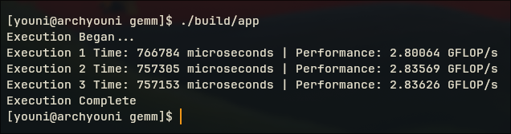
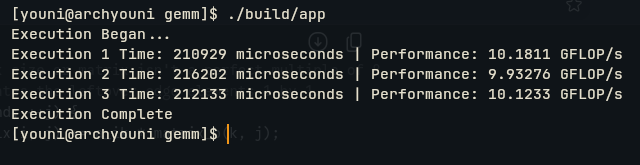
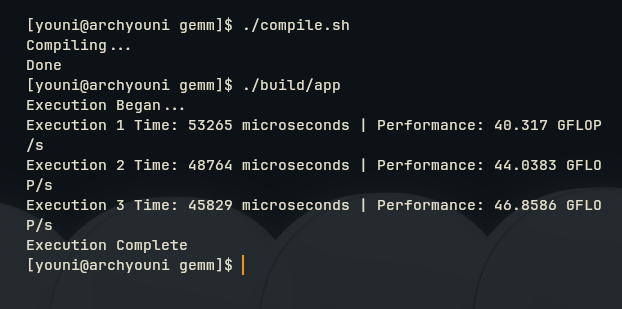
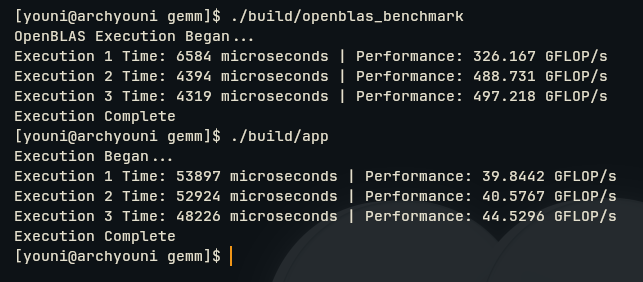

# Single-Precision GEMM in C++

An implementation of single-precision general matrix multiplication (GEMM) in C++, progressing from a naive triple-loop baseline towards a version that approaches practical peak CPU performance. Every stage is measured, not assumed, with the reasoning behind each optimisation documented alongside the resulting numbers. The final block size is not hand-picked; it is chosen by an autotuner that searches the parameter space empirically.

This is a high-performance computing project in the literal sense: the goal is not just a working GEMM, but a record of *why* each transformation improves performance, backed by measurement.

Open source under the MIT licence. Contributions and further work are welcome.

---

## Roadmap

- [x] Naive triple-loop baseline (`vector<vector<T>>`)
- [x] Flatten to contiguous 1D row-major storage
- [x] Cache blocking / tiling
- [x] SIMD vectorisation (AVX2/FMA)
- [x] Multithreading (OpenMP)
- [x] Autotuner for block size
- [x] Benchmark against OpenBLAS at every stage

---

## Benchmark Methodology

Wall-clock execution time alone is a poor performance metric: it is sensitive to CPU clock fluctuations, thermal throttling, and hardware differences across machines. To get a hardware-agnostic figure, throughput is reported in **GFLOP/s** (giga floating-point operations per second) instead.

For an $N \times N \times N$ matrix multiplication, the total floating-point operation count is:

$$
\text{FLOPs} = 2N^3
$$

For $N = 1024$, this is approximately 2.15 billion floating-point operations per run. Unless stated otherwise, all results below use $N = 1024$, `-O3 -march=native`, and three repeated runs.

---

## Implementation Log

### v1: Naive Triple-Loop, `vector<vector<T>>`


The first working implementation, with the expected $O(n^3)$ time complexity. Matrices are represented as `vector<vector<T>>`, which seemed like the natural choice for a 2D mathematical object but turns out to be a poor fit for CPU performance, for a few reasons:

1. **No contiguity.** A `vector<vector<T>>` is an outer vector of pointers, where each pointer refers to an inner vector (a row) allocated independently somewhere on the heap.
2. **Pointer chasing.** To reach a given row, the CPU must first dereference the outer vector, then follow that pointer to a separate heap allocation. Rows are not guaranteed to be adjacent in memory, or even nearby.
3. **Cache misses.** This scattered layout defeats the CPU's prefetcher and produces cache misses on nearly every row access, stalling the pipeline while data is fetched from RAM.

The fix is to give the CPU one contiguous block of memory to work with, which enables hardware prefetching and makes SIMD vectorisation possible in later stages.

### v2: Flattened to 1D, Row-Major Order


RAM is not a grid, it is a single contiguous line of bytes. The matrix is flattened accordingly: row 0 is followed immediately by row 1, then row 2, and so on. A `(row, col)` coordinate is mapped onto this 1D buffer with the standard row-major indexing formula:

$$
\text{index} = (\text{row} \times \text{total\_columns}) + \text{col}
$$

This keeps the entire matrix in one contiguous allocation, removing the pointer chasing from v1.

#### Results


**Average: ~3.50 s, ~0.61 GFLOP/s.** This is the baseline against which every later stage is compared.

#### Analysis: the memory wall

A single modern CPU core is capable of tens to hundreds of GFLOP/s. Achieving only 0.61 GFLOP/s here is not a fluke, it is a direct consequence of memory access pattern rather than raw compute capability.

Contiguous storage alone removes pointer chasing but does not fix the underlying issue: the naive `i, j, k` loop order accesses matrix B column-wise in the innermost loop, striding through memory with poor spatial locality. This evicts useful data from L1/L2 cache long before it can be reused, so the compute units sit idle waiting on data from main memory far more often than they perform useful work. This is a **memory-bound**, not compute-bound, workload, and it demonstrates that compiler flags alone (`-O3`, `-march=native`) cannot fix an algorithm whose loop structure is fighting the cache hierarchy. The next stages (blocking/tiling, then vectorisation) address this directly.

### v3: True SGEMM + Loop Reordering (i, k, j)



Two changes were applied together in this step:

1. **Genuine single precision.** Every `double` in `Matrix` was replaced with `float`: the storage vector, the constructor's `initial_value`, and both `operator()` overloads. A 32-bit float doubles the number of elements that fit in a cache line and in a SIMD register relative to `double`, so this is a prerequisite for effective vectorisation later, independent of any loop reordering.

2. **Loop permutation, `i, j, k` → `i, k, j`.** In the original `i, j, k` order, the innermost loop walks `matrix_b(k, j)` along `k`, i.e. down a column, striding by `total_columns` elements on every iteration. For a 1024-wide matrix that is a 4096-byte stride, one new cache line touched per iteration, no reuse. Reordering so `j` is innermost makes the access `matrix_b(k, j)` walk along a row, i.e. unit stride. The hardware prefetcher recognises the sequential pattern and streams the row into L1 ahead of demand. `matrix_a(i, k)` is loop-invariant with respect to `j`, so it is hoisted out of the innermost loop and kept in a register (`a_ik`) rather than reloaded 1024 times.

```cpp
Matrix final_matrix(matrix_a.get_rows(), matrix_b.get_colum(), 0.0f);

for (int i = 0; i < matrix_a.get_rows(); ++i) {
  for (int k = 0; k < matrix_a.get_colum(); ++k) {
    float a_ik = matrix_a(i, k);          // loop-invariant, hoisted into a register
    for (int j = 0; j < matrix_b.get_colum(); ++j) {
      final_matrix(i, j) += a_ik * matrix_b(k, j);   // unit-stride access
    }
  }
}
```

Note the accumulation pattern also changed: v2 computed a full dot product into a scalar `running_total` before a single write to `final_matrix[i][j]`. v3 accumulates directly into `final_matrix(i, j)` across the `k` loop, trading one register-resident accumulator for repeated read-modify-write on the output matrix. At this matrix size the output row stays cache-resident across the `k` iterations, so the trade is favourable here, but it is a second, unmeasured variable stacked on top of the two above.

#### Results

**Average: ~0.760 s, ~2.82 GFLOP/s**, a **4.6× improvement** over the v2 baseline (0.61 GFLOP/s).

#### Caveat: confounded variables

This result cannot be decomposed into "how much did `float` contribute" versus "how much did loop reordering contribute." The two changes were shipped together. Isolating them required an ablation:

- [x] Benchmark `float` storage with the **original** `i, j, k` loop order, isolating the type change
- [x] Benchmark `double` storage with the **new** `i, k, j` loop order, isolating the reordering

Given that `i, k, j` eliminates a column-strided access entirely while the `float`-vs-`double` change only affects cache line and register packing density, the ablation confirmed loop reordering as the dominant term.

### v4: Cache Blocking (Tiling)

Loop reordering (v3) fixed spatial locality in the innermost loop but left temporal locality unaddressed at the level of the full matrix. For $N = 1024$, a row of `matrix_b` is $1024 \times 4\ \text{bytes} = 4\ \text{KiB}$, and the working set touched across one full sweep of the `k` loop exceeds L1 capacity well before the sweep completes. Data brought into L1 early in the `k, j` traversal is evicted before `i` advances far enough to reuse it, so the CPU is still making repeated round trips to L2/L3 for data it has already seen.

The fix is to restructure the computation into six nested loops instead of three: three outer loops iterate over block coordinates, and three inner loops perform the standard `i, k, j` multiplication strictly within the bounds of the current block. Matrices A, B and the accumulator are partitioned into $64 \times 64$ sub-blocks, sized so that the active tile of each operand fits in L1 simultaneously. Every multiply-accumulate for a given block is exhausted before the block is evicted, so each cache line loaded is reused across the full block rather than once.

#### Results

**Average: ~0.225 s, ~9.50 GFLOP/s**, a **~3.4× improvement** over v3 (2.82 GFLOP/s) and a **~15.6× improvement** over the v2 baseline (0.61 GFLOP/s).

#### Caveat: block size was not swept

64×64 was chosen by hand, not derived from the target machine's actual L1 capacity or associativity. Resolved in v7, where the block size is derived empirically instead of assumed.

### v5: SIMD Vectorisation (AVX2 + FMA)

Cache blocking (v4) resolved the memory-bound behaviour of the workload, shifting the bottleneck to the compute units themselves. Scalar `+` and `*` map to one float operation per instruction, so even with data resident in L1 the core is executing far below its theoretical throughput.

Two changes were made together:

1. **32-byte aligned storage.** `Matrix` now allocates through a custom `AlignedAllocator` backed by `std::aligned_alloc`, guaranteeing 32-byte alignment. This is a hard requirement for `_mm256_load_ps`/`_mm256_store_ps`; unaligned pointers passed to the aligned load/store variants fault rather than degrade gracefully.
2. **Manual AVX2/FMA intrinsics in the innermost loop**, replacing the scalar `i, k, j` body:

   - `_mm256_set1_ps` broadcasts `matrix_a(i, k)` into all eight lanes of a 256-bit register.
   - `_mm256_load_ps` reads eight contiguous `matrix_b` floats per iteration instead of one.
   - `_mm256_fmadd_ps` performs eight multiply-accumulates in a single instruction.
   - `_mm256_store_ps` writes the eight-wide result back.

This replaces eight scalar iterations of the innermost `j` loop with one vector iteration, within each 64×64 block established in v4.

#### Results



**Average: ~0.213 s, ~10.08 GFLOP/s**, a **~1.06× improvement** over v4 (9.50 GFLOP/s).

#### Caveat: the gain is far below the 8× the SIMD width implies

An 8-wide FMA unit operating on data already resident in L1 should not yield a ~6% improvement. Candidate explanations, none confirmed:

- [ ] `-march=native` under `-O3` may already have auto-vectorised the v4 scalar loop, making the manual intrinsics redundant rather than additive. Compare against the v4 disassembly (`objdump -d` / Compiler Explorer) to check for existing `vfmadd` instructions before attributing any of this gain to the intrinsics.
- [ ] The 64×64 block size was tuned informally in v4 around scalar access patterns, not around register-blocking for 8-wide FMA. Resolved in v7, but the sweep there was over block size, not over vector width interaction — this specific question remains open.
- [ ] Store-side overhead: `_mm256_store_ps` on the accumulator every inner iteration re-introduces the same read-modify-write traffic on `final_matrix` flagged as an unmeasured variable back in v3, now happening eight floats at a time instead of one.

Profiling with Nsight/`perf` was deferred in favour of moving to multithreading; a compute-bound explanation should show near-zero L1 miss rate and high port utilisation on the FMA unit, and this has not yet been confirmed.

### v6: Multithreading (OpenMP)

With a single core now vectorised and cache-blocked, the majority of the machine's compute capacity was still idle: a modern CPU has multiple physical cores, and a single-threaded loop, however optimised, uses only one of them.

The outermost block loop (`i_block`) was parallelised with `#pragma omp parallel for`. Because the algorithm is already partitioned into cache blocks, each thread can be assigned an independent horizontal slice of `matrix_a` and `final_matrix`. No two threads ever write to the same output address, so this requires no locks or atomics.

#### Results



**Average: ~0.0458 s, ~46.86 GFLOP/s**, a **~4.65× improvement** over the single-threaded AVX2 implementation (v5, 10.08 GFLOP/s) and **~76.7× over the v2 baseline** (0.61 GFLOP/s).

#### Caveat: scaling efficiency was not computed

Thread count and core count are not reported here, so ~4.65× cannot be judged against the machine's actual parallelism. If, say, 8 cores were available, 4.65× is roughly 58% scaling efficiency, not the near-linear result the headline number suggests. Also unlike every other stage, this result was not reported across three repeated runs, so there is no variance figure to judge stability against. Before this is called done: report `nproc`, compute speedup relative to core count rather than relative to v5 alone, and re-run three times.

### v7: Empirical Autotuning

The block size of 64, used from v4 onward, was a heuristic, not a measurement. Cache sizes and loop overhead vary across microarchitectures, so hardcoding it either leaves performance on the table on other hardware or risks cache spillage. An autotuner script compiles and runs the kernel across `BLOCK_SIZE = {16, 32, 64, 128, 256}`, injected at compile time via `-D` so the compiler can fold the constant into loop bounds.

#### Results

Three runs per block size, $N = 1024$:

| Block size | Run 1 (GFLOP/s) | Run 2 (GFLOP/s) | Run 3 (GFLOP/s) | Mean | Range |
|---|---|---|---|---|---|
| 16  | 32.22 | 30.67 | 33.11 | 32.00 | 2.44 |
| 32  | 39.88 | 37.00 | 37.86 | 38.25 | 2.89 |
| 64  | 39.78 | 40.80 | 44.42 | 41.67 | 4.64 |
| 128 | 41.81 | 40.92 | 42.39 | 41.71 | 1.47 |
| 256 | 30.07 | 34.29 | 34.61 | 32.99 | 4.54 |

Block size 64 was selected as the operating point.

#### Caveat: 64 and 128 are statistically indistinguishable at $n=3$

The mean at block size 64 (41.67 GFLOP/s) and block size 128 (41.71 GFLOP/s) differ by 0.04 GFLOP/s, well inside the run-to-run spread of either (4.64 and 1.47 GFLOP/s respectively). The single best run at 64 (44.42 GFLOP/s) is the number quoted in conclusions elsewhere, but it is the maximum of three samples, not a stable estimate, and 128 is in fact the more consistent of the two (tighter range, comparable mean). Three runs is not enough to resolve this. Before treating 64 as final: increase to at least 10–15 runs per block size, and compare on median and spread rather than best-of-three, per the general benchmarking discipline used elsewhere in this log.


### Final Benchmark: Custom GEMM vs. OpenBLAS

The goal of this comparison is to place the fully optimised, hand-written C++ SGEMM (v7, autotuned to block size 64) against OpenBLAS, the reference production BLAS used underneath frameworks such as PyTorch and NumPy, on identical 1024×1024 single-precision matrices.

#### Results



Three runs each:

| Implementation | Run 1 (GFLOP/s) | Run 2 (GFLOP/s) | Run 3 (GFLOP/s) | Mean |
|---|---|---|---|---|
| Custom C++ (v7, block 64) | 39.84 | 40.58 | 44.53 | 41.65 |
| OpenBLAS | 326.17 | 488.73 | 497.22 | 437.37 |

OpenBLAS outperforms the custom kernel by **~10.5×** at the mean. Against the original v2 baseline (0.61 GFLOP/s), the custom kernel's 41.65 GFLOP/s represents a **~68×** improvement from contiguous storage, loop reordering, tiling, AVX2/FMA, OpenMP and autotuning combined.

#### Analysis

The gap is not a failure of the approach so far, it is the expected shape of the curve. Compiler-emitted AVX2 from source-level intrinsics gets a single core to double digits of GFLOP/s; OpenBLAS's kernels are hand-written in assembly with multi-level blocking across L1, L2 and L3, explicit register tiling tuned per microarchitecture, and packing routines that reformat operands ahead of the matmul to guarantee unit-stride access at every cache level simultaneously, none of which this project has implemented. The 10.5× gap is roughly consistent with the difference between single-level L1 blocking and a full multi-level blocking hierarchy plus hand-scheduled register tiling.

#### Caveat: the OpenBLAS numbers are not stable across runs

Run 1 (326.17 GFLOP/s) is 33% below runs 2 and 3 (488.73, 497.22), almost certainly a cold-cache or thread-spin-up effect on the first invocation rather than a representative sample. Averaging all three understates OpenBLAS's steady-state throughput; the 488–497 GFLOP/s pair is the more honest figure, which would put the true gap closer to **~11.7×** rather than 10.5×. As with v7, three runs is too few to separate a genuine outlier from real variance, more repetitions with the first run either discarded or treated as a separate warm-up measurement would resolve this before quoting a final number.

---

## License

MIT. See `LICENSE`.
