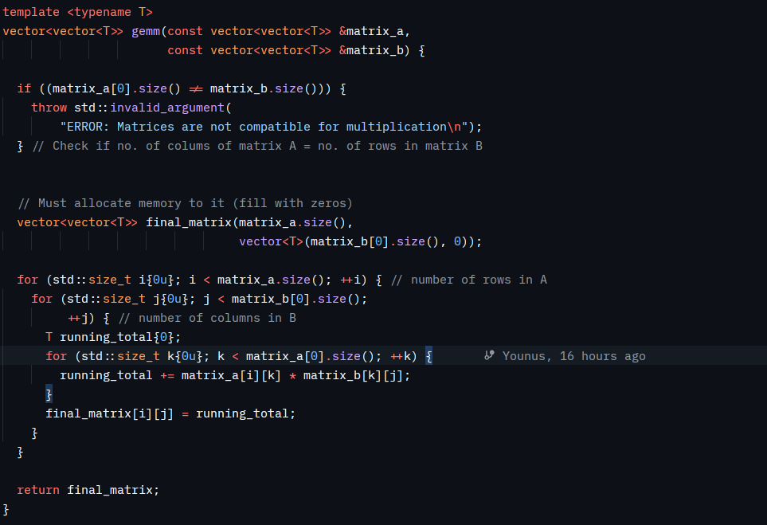
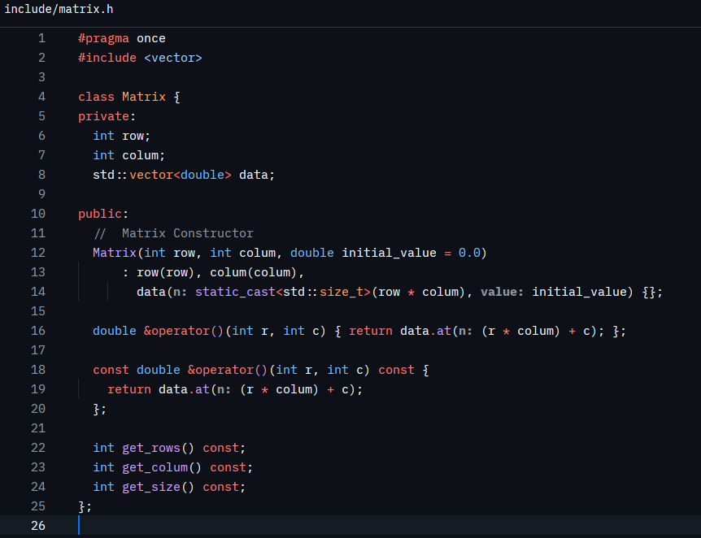
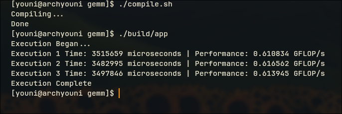

# Single-Precision GEMM in C++

An implementation of single-precision general matrix multiplication (GEMM) in C++, progressing from a naive triple-loop baseline towards a version that approaches practical peak CPU performance. Once the hand-optimised path is complete, an autotuner will search the optimisation parameter space empirically rather than relying on hand-picked constants. Every stage is benchmarked against OpenBLAS as an external reference, with the reasoning behind each optimisation documented alongside the resulting numbers.

This is a high-performance computing project in the literal sense: the goal is not just a working GEMM, but a record of *why* each transformation improves performance, backed by measurement.

Open source under the MIT licence. Contributions and further work are welcome.

---

## Roadmap

- [x] Naive triple-loop baseline (`vector<vector<T>>`)
- [x] Flatten to contiguous 1D row-major storage
- [ ] Cache blocking / tiling
- [ ] SIMD vectorisation (AVX2/AVX-512)
- [ ] Multithreading
- [ ] Autotuner for block size and tiling parameters
- [ ] Benchmark against OpenBLAS at every stage

---

## Implementation Log

### v1: Naive Triple-Loop, `vector<vector<T>>`

The first working implementation, with the expected $O(n^3)$ time complexity. Matrices are represented as `vector<vector<T>>`, which seemed like the natural choice for a 2D mathematical object but turns out to be a poor fit for CPU performance, for a few reasons:

1. **No contiguity.** A `vector<vector<T>>` is an outer vector of pointers, where each pointer refers to an inner vector (a row) allocated independently somewhere on the heap.
2. **Pointer chasing.** To reach a given row, the CPU must first dereference the outer vector, then follow that pointer to a separate heap allocation. Rows are not guaranteed to be adjacent in memory, or even nearby.
3. **Cache misses.** This scattered layout defeats the CPU's prefetcher and produces cache misses on nearly every row access, stalling the pipeline while data is fetched from RAM.

The fix is to give the CPU one contiguous block of memory to work with, which enables hardware prefetching and makes SIMD vectorisation possible in later stages.

### v2: Flattened to 1D, Row-Major Order

RAM is not a grid, it is a single contiguous line of bytes. The matrix is flattened accordingly: row 0 is followed immediately by row 1, then row 2, and so on. A `(row, col)` coordinate is mapped onto this 1D buffer with the standard row-major indexing formula:

$$
\text{index} = (\text{row} \times \text{total\_columns}) + \text{col}
$$

This keeps the entire matrix in one contiguous allocation, removing the pointer chasing from v1.

---

## Benchmark Methodology

Wall-clock execution time alone is a poor performance metric: it is sensitive to CPU clock fluctuations, thermal throttling, and hardware differences across machines. To get a hardware-agnostic figure, throughput is reported in **GFLOP/s** (giga floating-point operations per second) instead.

For an $N \times N \times N$ matrix multiplication, the total floating-point operation count is:

$$
\text{FLOPs} = 2N^3
$$

For $N = 1024$, this is approximately 2.15 billion floating-point operations per run.

## Results

Baseline (v2, naive loop order, contiguous 1D storage), compiled with `-O3 -march=native`, 1024×1024 matrices, three runs:

| Run | Time (µs) | Throughput (GFLOP/s) |
|-----|-----------|-----------------------|
| 1   | 3,515,659 | 0.611 |
| 2   | 3,482,995 | 0.617 |
| 3   | 3,497,846 | 0.614 |

**Average: ~3.50 s, ~0.61 GFLOP/s.**

### Analysis: the memory wall

A single modern CPU core is capable of tens to hundreds of GFLOP/s. Achieving only 0.61 GFLOP/s here is not a fluke, it is a direct consequence of memory access pattern rather than raw compute capability.

Contiguous storage alone removes pointer chasing but does not fix the underlying issue: the naive `i, j, k` loop order accesses matrix B column-wise in the innermost loop, striding through memory with poor spatial locality. This evicts useful data from L1/L2 cache long before it can be reused, so the compute units sit idle waiting on data from main memory far more often than they perform useful work. This is a **memory-bound**, not compute-bound, workload, and it demonstrates that compiler flags alone (`-O3`, `-march=native`) cannot fix an algorithm whose loop structure is fighting the cache hierarchy. The next stages (blocking/tiling, then vectorisation) address this directly.

---

## License

MIT. See `LICENSE`.
